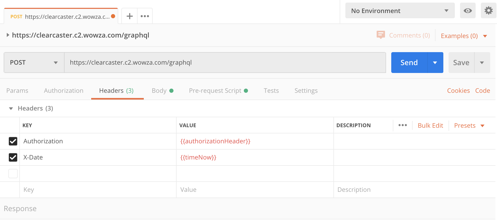

# Sign GraphQL API Requests for the Wowza ClearCaster GraphQL API

This repository contains brief code examples in several different languages that illustrate how to sign Wowza ClearCaster GraphQL API requests. See [Wowza ClearCaster GraphQL API documentation](https://www.wowza.com/docs/wowza-clearcaster-graphql-api) for more information about the API and its use.

## Prequisites
- An API key
- A secret key

To obtain and API key and secret key, sign in to the [Wowza ClearCaster Manager](https://clearcaster.wowza.com), click the **Manage** tab and select **Integrations**. Then click **Generate a New ClearCaster API Key**, and copy and save the generated **API Key**, **Secret Key**, and **GraphiQL URL** for later use.

## Javascript
  1. Install [Node.js](https://nodejs.org/).
  2. Modify the **index.js** file to replace **[API-Key-Here]** and **[Secret-Key-Here]** with the API key values from the Wowza ClearCaster Manager **Integrations** tab.
  3. Run `npm install` then `npm start`.

## Java
  1. Install [JDK 8](https://www.oracle.com/java/technologies/) or later.
  2. Modify **src/main/Main.java** to replace **[API-Key-Here]** and **[Secret-Key-Here]** with the API key values from the Wowza ClearCaster Manager **Integrations** tab.
  3. Run `./compile.sh` then `./run.sh`.

## PHP
  1. Modify the **graphqlRequest.php** file to replace **[API-Key-Here]** and **[Secret-Key-Here]** with the API key values from the Wowza ClearCaster Manager  **Integrations** tab.
  2. Host the file on a web server that has [PHP 7](https://www.php.net/) or later installed.
  3. Open a browser and the enter URL that points to **graphqlRequest.php**.

## Python (3.x)
  1. Install [Python](https://www.python.org/).
  2. Modify the **graphqlRequest.py** file to replace **[API-Key-Here]** and **[Secret-Key-Here]** with the API key values from the Wowza ClearCaster Manager **Integrations** tab.
  3. Run `./run.sh`.

## .NET (C#)
  1. Install [Visual Studio 2019](https://visualstudio.microsoft.com/vs/).
  2. Open the solution **ConsoleApp1/ConsoleApp1.sln**.
  3. Modify the **Program.cs** file to replace **[API-Key-Here]** and **[Secret-Key-Here]** with the API key values from the Wowza ClearCaster Manager **Integrations** tab.
  4. Build and run the project.

## cURL
  1. Modify the **run.sh** file to replace **[API-Key-Here]** and **[Secret-Key-Here]** with the API key values from the Wowza ClearCaster Manager **Integrations** tab.
  2. Run `./run.sh`.
  
## Postman (via Pre-Request Script)
  1. In the Body tab, select the radio button for **GraphQL**. Build your query in the Query window.
  2. In the Headers tab, create two key value pairs for Authorization and X-Date with variables as the values.

  3. In the Pre-Request Script tab, copy the following script. 

```JavaScript
var crypto = require('crypto-js');
let requestTime = Date.now();

let key = "{{APIKEY}}";
let secret = "{{SECRETKEY}}";

let domain = "clearcaster.c2.wowza.com";

let hmacDigest = crypto.enc.Hex.stringify(crypto.HmacSHA256(domain, crypto.HmacSHA256(requestTime.toString(), secret)));
let authorizationHeader =`HMAC-SHA256, Credential=${key}, SignedHeaders=host;x-date, Signature=${hmacDigest}`;

console.log(hmacDigest);

pm.environment.set("authorizationHeader", authorizationHeader);
pm.environment.set("timeNow", requestTime);
```
  4. Set your query to `POST` and URL to `https://clearcaster.c2.wowza.com/graphql`
